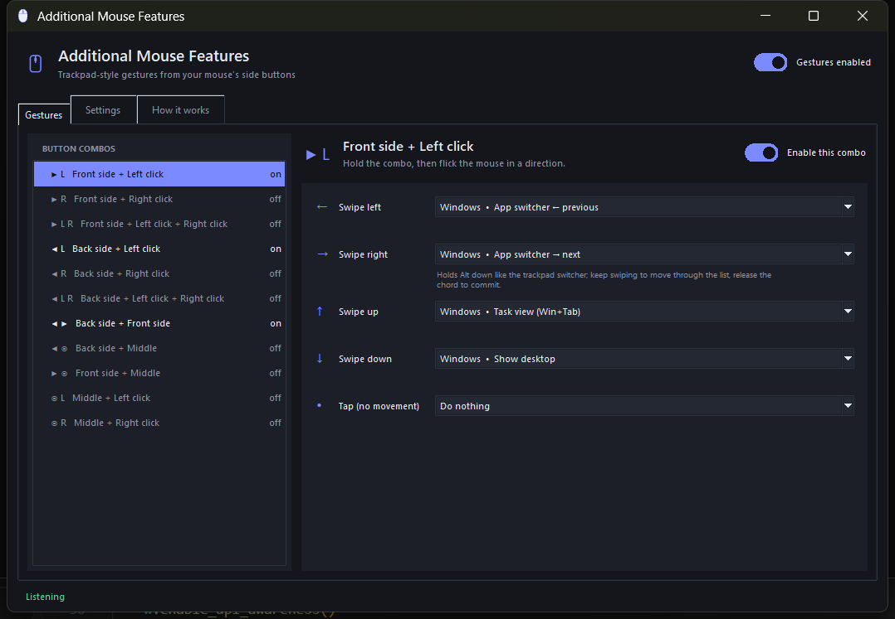

# Additional Mouse Features

Trackpad-style gestures for a mouse with two side buttons, on Windows.

A laptop trackpad switches apps well because three fingers move together. This
does the same thing with a mouse: hold a **side button plus a click**, flick the
mouse, and the gesture fires. Three fingers, same shape, on a mouse.

Pure Python, no dependencies — just the standard library talking to Win32.



## Running it

```
python run.pyw
```

Double-clicking `run.pyw` works too, and starts it without a console window.
Closing the window hides it to the tray; quit from the tray menu.

Requires Windows and Python 3.10+ (tkinter is part of the standard Windows
Python install).

## How the gestures work

1. Press and hold a side button.
2. While holding it, also hold left click — or right, or both.
3. Flick the mouse left, right, up or down.
4. Keep flicking the same way to keep going. The Alt-Tab switcher stays open
   while you hold, exactly like the trackpad.
5. Let go of the side button to commit.

Release the combo quickly without moving and you get the **tap** action instead.

### What's set up out of the box

| Combo | ← | → | ↑ | ↓ | tap |
|---|---|---|---|---|---|
| Front side + left click | prev app | next app | task view | show desktop | — |
| Back side + left click | prev tab | next tab | new tab | close tab | reopen tab |
| Back side + front side | prev desktop | next desktop | task view | show desktop | — |

Seven more combos (right click, both clicks, and middle-button variants) are
listed in the window and off by default. Every direction of every combo can be
pointed at any action: window management, tabs, media keys, volume, a custom
hotkey of your own, or launching a program.

### Your normal clicks still work

A side button pressed on its own still sends Back/Forward. The press is held
back for a moment and replayed when you release it without forming a combo.
Left and right clicks are never swallowed unless a combo is already running, so
ordinary mousing is untouched. A button that no enabled combo uses is passed
straight through and never intercepted at all.

## Settings

- **Run when I sign in to Windows** — adds a per-user entry under
  `HKCU\Software\Microsoft\Windows\CurrentVersion\Run`. No admin rights, no
  scheduled task, and it re-points itself if you move the folder.
- **Start minimised to the tray** — what the startup entry does when it fires.
- **Swipe distance / repeat distance / tap window** — how twitchy it feels.
- **Pin the pointer while a combo is held** — keeps the cursor still so a swipe
  doesn't drag it across the screen.

Settings live in `%APPDATA%\AdditionalMouseFeatures\config.json` and are saved
as you change them.

## Known limits

- Windows won't let a normal program send input to an elevated one. If gestures
  do nothing in an app running as administrator, run this as administrator too.
- Some gaming mice send their side buttons through their own driver software
  rather than as standard mouse input. If a side button never registers, turn
  off *Ignore software-generated mouse input* in Settings.

## Layout

```
run.pyw              windowless launcher
amf/
  winapi.py          ctypes structures, constants, SendInput helpers
  engine.py          the low-level mouse hook and chord/swipe state machine
  actions.py         the action catalogue and what each one does
  config.py          the combo catalogue, defaults, JSON load/save
  ui.py              the settings window
  tray.py            tray icon (Shell_NotifyIcon)
  startup.py         the run-at-logon registry entry
  icon.py            the app icon, drawn in code
tests/test_engine.py
```

The hook callback only does bookkeeping — Windows silently drops hooks whose
callback is slow, so every action is handed to a worker thread.

## Tests

```
python tests/test_engine.py
```

33 tests drive the chord state machine with synthetic hook events: chords
engaging, clicks being swallowed and replayed, axis locking, repeat behaviour,
taps, and recovery from a missed button release. No mouse required.
